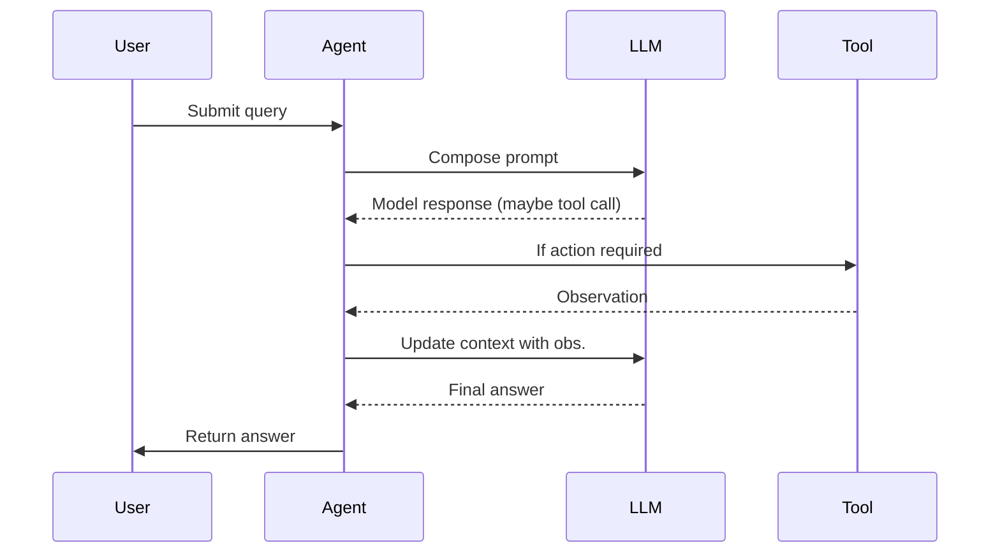

# Project 01 — Agent Runtime Skeleton

**Phase:** 0 — AI-Native Programming Foundation
**Difficulty:** Beginner · **Est. time:** 1–2 days

## Purpose

Build the smallest possible agent: something that takes a user prompt, sends it to an LLM, optionally calls one tool based on the LLM's response, and returns a final answer. This is the seed every later project grows from — get the loop right here and Projects 02–06 are extensions of it, not rewrites.

## Architecture

```
User → Agent → LLM → (Tool, if needed) → Agent → User
```



## Tech stack

- Python 3.11+
- An LLM API (OpenAI, Anthropic, or a local model) — any provider works, the loop logic is what matters
- Plain JSON for message formatting — no framework required
- *Optional:* LangChain's basic `LLMChain` if you want to compare a framework-managed loop against your own

## Implementation notes

- Manage conversation state explicitly in a loop — don't hide it inside a library abstraction yet; the point of this project is to see the loop.
- Define exactly **one** simple tool to start (e.g. a calculator, or `read_file(path)` scoped to a sandbox directory). The agent should be able to call it by emitting a recognizable, parseable signal (e.g. a JSON object with an `action` field) rather than free text.
- Keep the tool-call format structured (JSON with `action`/`answer` fields) from day one — this is the pattern every later tool-calling project builds on.
- No complex SDK, no multi-tool dispatch yet — that's Project 02.

## Inputs / outputs

| | |
|---|---|
| **Input** | A natural-language prompt from the user |
| **Output** | Final answer text, with any tool results folded in |

## Test cases

1. **No-tool path:** prompt with a static/general-knowledge question → agent returns a direct answer without invoking the tool.
2. **Tool-invocation path:** prompt like *"calculate 2+2"* → agent emits the structured tool call, your code executes it, and the observation is correctly returned to the LLM.
3. **Tool-output handling:** verify the tool's output is correctly inserted back into context and reflected in the final answer (not just logged and ignored).

## Evidence collection

Log every turn: prompt sent, raw LLM output, any action taken, the tool's observation, and the final result. Write this out as a JSON trace or plain transcript per session — you'll reuse this evidence pattern (and eventually formalize it) all the way through Phase 10.

## Safety checklist

- [ ] Runs entirely locally — no network calls except to your chosen LLM API and the one whitelisted tool
- [ ] Tool execution is restricted to the intended function only (e.g. no shell access, no arbitrary file paths)
- [ ] Input size is validated/bounded before it reaches the LLM or the tool
- [ ] No real credentials or secrets anywhere in code or logs

## Failure modes & mitigations

| Failure mode | Mitigation |
|---|---|
| Infinite loop — agent never decides to stop | Hard cap on loop iterations |
| Malformed JSON from the LLM | Enforce an output schema; validate before parsing; re-prompt on failure |
| LLM ignores the tool-call format entirely | Tighten system instructions; give a concrete example of the expected format in the prompt |

## Suggested folder layout

```
01-agent-runtime-skeleton/
├── README.md          # this file
├── src/
│   ├── agent.py        # the loop
│   ├── tool.py         # the one whitelisted tool
│   └── llm_client.py   # thin wrapper around your chosen LLM API
├── tests/
│   └── test_agent.py   # the 3 test cases above
└── evidence/
    └── .gitkeep         # session transcripts land here (gitignored)
```

## Definition of done

- All three test cases pass.
- You have at least one saved transcript in `evidence/` showing a full tool-call round trip.
- You can explain, in a sentence, where the trust boundary is in this system (hint: it's the line between "LLM output" and "code that executes based on that output").
