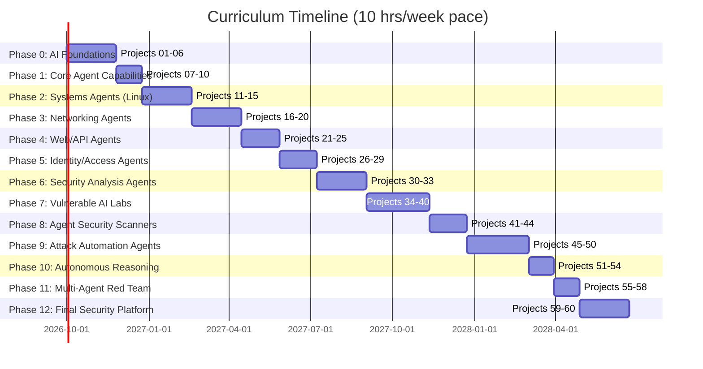

# AI-Agent Security & Red-Team Curriculum

A project-based learning path for mastering **AI-agent development**, **systems/networking fundamentals**, and **AI-specific security** — culminating in an autonomous AI-agent red-team platform.

You'll start by building agents from scratch (loops, memory, tools), progressively add real capabilities (files, code execution, APIs, databases), layer in systems/network/web security fundamentals, then flip to offense: build deliberately vulnerable agents, attack them, and finally assemble a multi-agent red-team framework that can recon, threat-model, test, and report on an AI system's security — all against your own authorized lab targets.

## ⚠️ Safety & Legal Notice — read this first

This repo is for **defensive security education and authorized testing only**.

- **Never test anything you don't own or don't have explicit written authorization to test.** Per the Nmap project's legal guidance, always secure written authorization before scanning or attacking any system.
- All offensive/red-team projects (Phases 3–12) run **only against your own lab environment**: local VMs, containers, or isolated virtual networks (NAT mode, no internet exposure).
- Use known intentionally-vulnerable applications for practice — e.g. OWASP WebGoat and DVWA — and run them exactly as their maintainers instruct (offline / localhost only, never on a public host or shared network).
- Never use real credentials, real personal data, or production systems in any lab.
- Sandboxed code execution (Project 08 onward) must run with no network access, restricted CPU/RAM, and no dangerous syscalls until you've explicitly reasoned about the blast radius.
- Every project that "attacks" something (Phases 7, 9–12) is built specifically to be attacked *by you, in your lab* — it is not for use against third parties.

If you're not sure whether a target is authorized, it isn't. Don't run it.

## What's in here

| | |
|---|---|
| **Format** | 12 phases, 60 hands-on projects, each with purpose, architecture, tech stack, tests, evidence collection, safety checklist, and failure modes/mitigations |
| **Language/stack** | Python-first, LLM API (OpenAI/Anthropic/local), Docker/VMs for labs, Mermaid for diagrams |
| **Outcome** | The ability to look at any AI-agent system and ask "who controls the memory, can it call a shell, where are the trust boundaries" — then build tests to probe and harden it |

Full project-by-project detail (purpose, diagrams, implementation notes, test cases) lives in [`docs/project-plan.md`](docs/project-plan.md). This README is the map; that doc is the territory.

## Curriculum roadmap

**Pacing note:** the schedule below is sized for someone with about **10 hours/week** to give this (e.g. two ~5-hour sessions, or an hour on weeknights plus a longer weekend block). The original per-phase effort estimates assumed a much heavier weekly commitment (~20 hrs/week); everything here has been roughly doubled to fit a steady 10 hrs/week pace instead of a near-full-time one. At 10 hrs/week, the gantt chart's single-path schedule below runs about **90 weeks (~21 months)**, and the full effort ranges in the table underneath put the realistic range at **~84–128 weeks (roughly 1.6–2.5 years)**, depending on how much you linger on any given phase. Don't compress the safety checklists or evidence-collection steps to hit a faster pace — those are the parts of each project that are easiest to skip and most important not to.



| Phase | Projects | Focus | Key skills | Prerequisites | Effort (at 10 hrs/wk) |
|---|---|---|---|---|---|
| 0 | 01–06 | AI-native programming foundation | Agent loops, tool calling, structured output, memory, multi-agent basics | Python basics, LLM API access | 8–12 wk |
| 1 | 07–10 | Real capabilities | Filesystem, sandboxed code exec, API/DB integration | Phase 0, basic OS/SQL | 8 wk |
| 2 | 11–15 | Systems (Linux) agents | Process/permission/config auditing, container security | Phase 0–1, Linux CLI | 8–12 wk |
| 3 | 16–20 | Networking agents | Nmap/DNS/HTTP analysis, topology mapping, anomaly detection | Phase 0–2, basic networking | 8–12 wk |
| 4 | 21–25 | Web/API security agents | AuthN/AuthZ analysis, API security, business-logic flaws | Phase 3, web/HTTP basics | 6–10 wk |
| 5 | 26–29 | Identity & access-control agents | RBAC/ABAC modeling, privilege graphs, trust boundaries | Phase 4, RBAC concepts | 4–8 wk |
| 6 | 30–33 | Security analysis agents | Vuln triage, evidence correlation, attack-path reasoning, reporting | Phase 4–5, pentest fundamentals | 6–10 wk |
| 7 | 34–40 | Vulnerable AI-agent labs | Prompt injection (direct/indirect), tool abuse, memory poisoning, excessive agency | All above + isolated lab env | 8–12 wk |
| 8 | 41–44 | Agent security scanners | Architecture/permission/trust-boundary analysis, automated threat modeling | Phase 0–7, OWASP threat modeling | 4–8 wk |
| 9 | 45–50 | Attack automation agents | Prompt-attack generation, policy evaluation, adaptive testing, fuzzing | Phase 6–8, scripting | 6–10 wk |
| 10 | 51–54 | Autonomous security reasoning | Hypothesis engines, attack graphs, evidence logging, finding verification | Phase 8–9, graph algorithms | 6–8 wk |
| 11 | 55–58 | Multi-agent red team | Specialized agent teams, orchestration, human-in-the-loop oversight | Phase 0–10 | 4–6 wk |
| 12 | 59–60 | Final security platform | End-to-end recon → threat model → test → verify → report pipeline | Entire curriculum | 8–12 wk |

## Repo structure

```
.
├── README.md                     ← you are here
├── docs/
│   └── project-plan.md           ← full 60-project spec (purpose, diagrams, tests, etc.)
├── lab-environment/               ← shared, isolated lab infra (NOT internet-facing)
│   ├── docker-compose.yml         ← e.g. DVWA, Juice Shop, target VMs
│   ├── vagrant/                   ← VM definitions for Linux/network labs
│   └── README.md                  ← lab setup + safety checklist
├── phase-00-ai-foundations/
│   ├── 01-agent-runtime-skeleton/
│   ├── 02-tool-calling-agent/
│   ├── 03-structured-output-agent/
│   ├── 04-agent-state-machine/
│   ├── 05-agent-memory/
│   └── 06-multi-agent-research-system/
├── phase-01-real-capabilities/
│   ├── 07-filesystem-agent/
│   ├── 08-sandboxed-code-agent/
│   ├── 09-api-agent/
│   └── 10-database-agent/
├── phase-02-systems-linux-agents/          # projects 11-15
├── phase-03-networking-agents/             # projects 16-20
├── phase-04-web-api-agents/                # projects 21-25
├── phase-05-identity-access-agents/        # projects 26-29
├── phase-06-security-analysis-agents/      # projects 30-33
├── phase-07-vulnerable-ai-labs/            # projects 34-40
├── phase-08-agent-security-scanners/       # projects 41-44
├── phase-09-attack-automation-agents/      # projects 45-50
├── phase-10-autonomous-reasoning/          # projects 51-54
├── phase-11-multi-agent-redteam/           # projects 55-58
├── phase-12-final-platform/                # projects 59-60
└── requirements.txt
```

Each project folder follows the same convention:

```
NN-project-name/
├── README.md          # purpose, architecture diagram, test cases, safety checklist (copied/expanded from docs/project-plan.md)
├── src/                # implementation
├── tests/              # test cases from the spec
└── evidence/           # logs/transcripts produced when you run it (gitignored by default)
```

## Getting started

**1. Prerequisites**
- Python 3.11+
- Docker (for sandboxed code execution and vulnerable-app labs)
- An LLM API key (OpenAI, Anthropic, or a local model runtime) exported as an environment variable — never commit keys
- A hypervisor (VirtualBox/UTM/etc.) or Vagrant for the Phase 2–3 Linux/network labs

**2. Set up the environment**
```bash
git clone <this-repo>
cd ai-agent-security-redteam-curriculum
python -m venv .venv && source .venv/bin/activate
pip install -r requirements.txt
cp .env.example .env   # add your LLM API key, never commit this file
```

**3. Bring up the isolated lab (needed from Phase 2 onward)**
```bash
cd lab-environment
docker compose up -d      # e.g. DVWA / Juice Shop on localhost only
# see lab-environment/README.md for VM/NAT network setup for Phases 2-3
```

**4. Work phase by phase**
Start at `phase-00-ai-foundations/01-agent-runtime-skeleton/`, read its README, implement, run its test cases, and check off the safety checklist before moving on. Each phase builds directly on the last — don't skip ahead into vulnerable-lab or attack-automation phases without the foundational trust-boundary thinking from Phases 0–6. At a 10 hrs/week pace, resist the urge to rush a phase just to keep the calendar on track; a shaky Phase 0–6 foundation shows up as confusion (or unsafe shortcuts) once you hit the offensive phases.

## Working conventions

- **Evidence over assertion.** Every finding an agent produces should carry ACTION → OBSERVATION → EVIDENCE → REASONING → CONFIDENCE, per Phase 10's evidence engine. Don't let an agent claim a vulnerability it didn't actually reproduce.
- **Least privilege by default.** New tools/agents start with the minimum scope needed for their test cases; broaden only when a test requires it, and note why in the project README.
- **Threat-model as you build, not after.** From Phase 1 onward, each project README should note the trust boundaries it introduces (agent vs. host OS, agent vs. network, agent vs. memory, etc.).
- **Everything offensive is opt-in and logged.** Red-team/attack-automation agents (Phases 7, 9–12) should require an explicit "authorized target" config pointing at `lab-environment/` — never a bare hostname/IP typed at runtime.

## Reference material

- OWASP WebGoat & DVWA documentation (run offline / NAT-only VM)
- Nmap Reference Guide, legal/ethics appendix
- OWASP Threat Modeling guidelines (STRIDE)
- OWASP ASVS (Application Security Verification Standard)
- Research on prompt injection, indirect prompt injection, and agent memory poisoning
- ReAct paper (reasoning + acting LLM agent loop)

## License

Choose a license appropriate for your use (MIT/Apache-2.0 are common for educational repos like this). Add it as `LICENSE` at the repo root.
